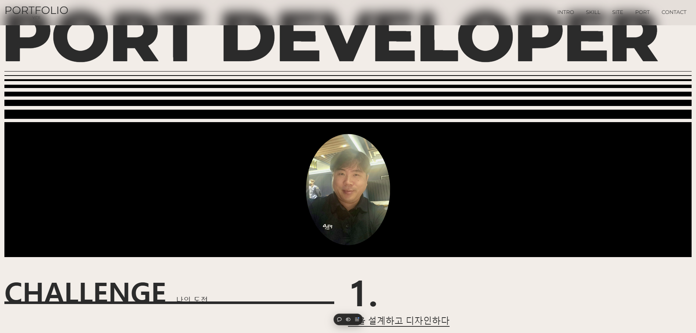

# 프로젝트 2 React Version

하나의 웹사이트를 여러 가지 프레임워크를 사용하여 만들어 봅니다.


1. [vite](https://ko.vitejs.dev/)를 이용하여 사이트를 제작합니다.
2. [react.js](https://ko.legacy.reactjs.org/)를 이용하여 사이트를 제작합니다.
3. [vue.js](https://ko.vuejs.org/)를 이용하여 사이트를 제작합니다.
4. [next.js](https://nextjs.org/)를 이용하여 사이트를 제작합니다.

포트폴리오 컨셉의 사이트를 4가지 버전으로 반복하여 만들어 보면, 웹사이트의 일련의 제작과정을
이해할 수 있고, 연습을 통해서 제작기법을 숙지할수 있고 다양한 방법을 사용하여
흐름과 감각을 익히기 좋은 방법이라고 생각합니다.

## 완성작 보기

🐠미리보기 : https://

## ☠ 사용 스택 👻

- 
  
  
  

- react(https://ko.legacy.reactjs.org/) 를 사용하여 사이트를 번들링하고 관리합니다.
- gsap(https://greensock.com/gsap) 를 이용하여 패럴랙스 효과를 줍니다.
- lenis(https://lenis.studiofreight.com/) 를 이용하여 스므스 효과를 구현합니다.
- netlify(https://www.netlify.com/) 를 통해 사이트를 배포합니다.
- git(https://github.com/) 을 사용하여 파일을 관리합니다.
- HTML, CSS 기반으로 웹사이트의 기본 레이아웃 설계하고, 웹 표준 및 웹 접근성을 준수하여 작업합니다. [ARIA(Accessible Rich Internet Applications)](https://developer.mozilla.org/en-US/docs/Web/Accessibility/ARIA/Roles)

## 프로젝트 실행

- react를 설치합니다. `npx create-react-app 타이틀`
- react-router-dom을 설치합니다. `npm install react-router-dom`
- sass를 설치합니다. `npm install sass`
- gsap를 설치합니다. `npm install gsap`
- lenis를 설치합니다. `npm install @studio-freight/lenis`

```javascript
export default defineConfig({
  build: {
    outDir: "dist", // 빌드 결과물이 저장될 디렉터리 이름
    emptyOutDir: true, // 기존 디렉터리를 비우고 새로 빌드
  },
});
```
